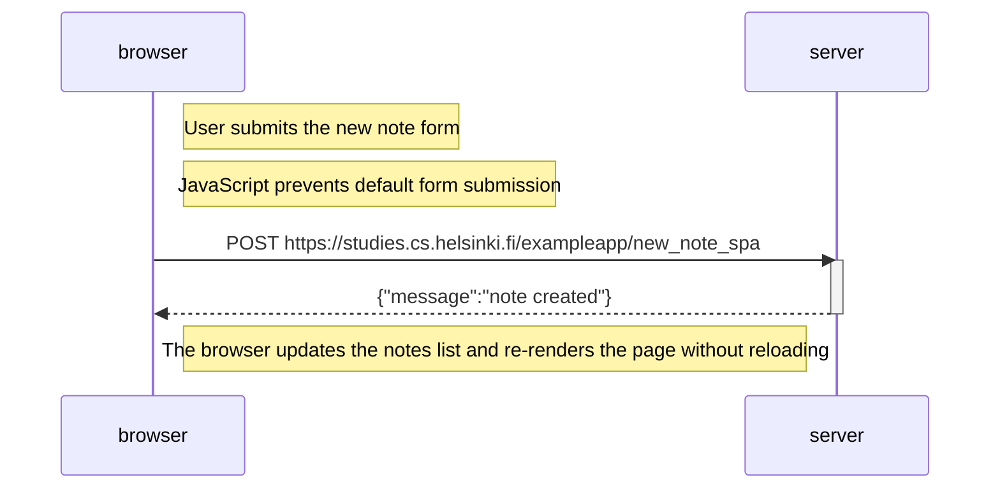

```mermaid
sequenceDiagram
    participant browser
    participant server

    Note right of browser: User submits the new note form
    Note right of browser: JavaScript prevents default form submission

    browser->>server: POST https://studies.cs.helsinki.fi/exampleapp/new_note_spa
    activate server
    server-->>browser: {"message":"note created"}
    deactivate server

    Note right of browser: The browser updates the notes list and re-renders the page without reloading
```
